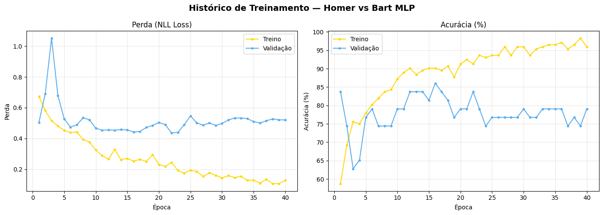
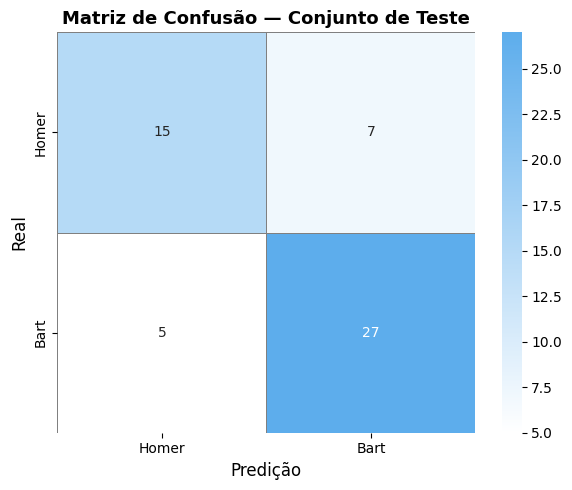
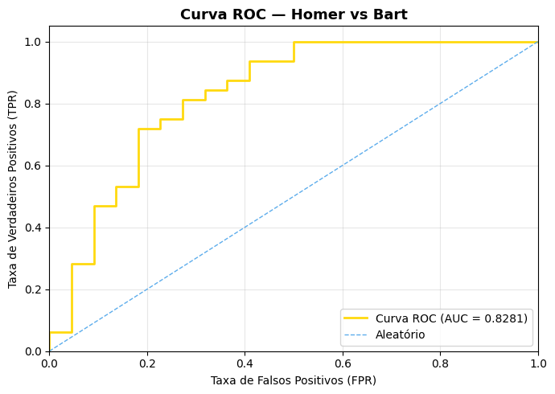
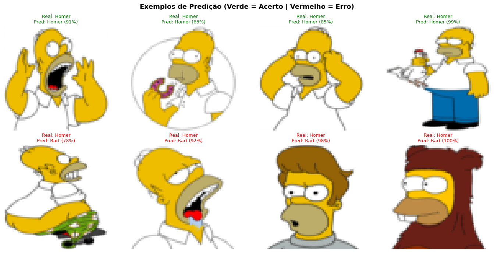

# homer-bart-classification
Classificação de imagens com MLP (PyTorch) — sem CNN

PT

# Classificação Homer vs Bart — Rede Neural MLP

Classificação binária de imagens dos personagens Homer e Bart Simpson utilizando uma rede neural MLP (Multi-Layer Perceptron) com PyTorch, sem o uso de camadas convolucionais.

## Objetivo

Construir e treinar uma rede neural totalmente conectada capaz de distinguir imagens dos personagens Homer e Bart Simpson, aplicando técnicas de regularização, data augmentation e avaliação de modelos.

## Dataset

- **Nome:** Neural Networks Homer and Bart Classification
- **Fonte:** [Kaggle — juniorbueno](https://www.kaggle.com/datasets/juniorbueno/neural-networks-homer-and-bart-classification)
- **Classes:** Homer (0) e Bart (1)
- **Formato:** Imagens .bmp organizadas em pastas por classe

## Tecnologias Utilizadas

- Python 3.10+
- PyTorch 2.x + torchvision
- scikit-learn (métricas)
- matplotlib + seaborn (visualizações)
- Pillow (manipulação de imagens)
- Google Colab (ambiente de execução)

## Arquitetura do Modelo

MLP com 4 camadas densas, sem convoluções:

| Camada | Entrada | Saída | Regularização |
|--------|---------|-------|---------------|
| fc1 | 12.288 | 2.048 | BatchNorm + Dropout(0.5) |
| fc2 | 2.048 | 512 | BatchNorm + Dropout(0.4) |
| fc3 | 512 | 128 | BatchNorm + Dropout(0.3) |
| fc_out | 128 | 2 | LogSoftmax |

- **Otimizador:** Adam (lr=1e-3, weight_decay=1e-4)
- **Scheduler:** StepLR — reduz LR em 50% a cada 10 épocas
- **Épocas:** 40

## Resultados

| Métrica | Valor |
|---------|-------|
| Acurácia (Teste) | 77.78% |
| F1-Score | 77.59% |
| AUC-ROC | 0.8281 |

## Visualizações

### Curvas de Treinamento

### Matriz de Confusão

### Curva ROC

### Exemplos de Predição

## Principais Aprendizados

- Overfitting é quase inevitável com poucos dados, assim a regularização é essencial
- Separar os transforms de treino e validação corretamente impacta diretamente a avaliação
- Salvar o checkpoint do melhor modelo é superior a usar o da última época
- Data Augmentation aumenta a robustez do modelo sem custo adicional de coleta de dados

## Como Executar

1. Clone o repositório
2. Instale as dependências: `pip install -r requirements.txt`
3. Baixe o dataset no Kaggle (link acima) e extraia em `data/`
4. Abra o notebook em `notebooks/`
5. Execute todas as células em ordem

## Autora

**Nathália Rayanne Lima Araújo**
Data Science | FP&A
[LinkedIn](https://www.linkedin.com/in/nath%C3%A1lia-ara%C3%BAjo-78b1b0262/)

EN

# Homer vs Bart Classification — MLP Neural Network

Binary image classification of Homer and Bart Simpson characters using a Multi-Layer Perceptron (MLP) with PyTorch — no convolutional layers.

## Objective

Build and train a fully connected neural network to distinguish Homer and Bart Simpson images, applying regularization, data augmentation, and model evaluation techniques.

## Dataset

- **Name:** Neural Networks Homer and Bart Classification
- **Source:** [Kaggle — juniorbueno](https://www.kaggle.com/datasets/juniorbueno/neural-networks-homer-and-bart-classification)
- **Classes:** Homer (0) and Bart (1)
- **Format:** .bmp images organized in class-labeled folders

## Tech Stack

- Python 3.10+
- PyTorch 2.x + torchvision
- scikit-learn (metrics)
- matplotlib + seaborn (visualizations)
- Pillow (image handling)
- Google Colab (runtime environment)

## Model Architecture

Fully connected MLP — 4 dense layers, no convolutions:

| Layer | Input | Output | Regularization |
|-------|-------|--------|----------------|
| fc1 | 12,288 | 2,048 | BatchNorm + Dropout(0.5) |
| fc2 | 2,048 | 512 | BatchNorm + Dropout(0.4) |
| fc3 | 512 | 128 | BatchNorm + Dropout(0.3) |
| fc_out | 128 | 2 | LogSoftmax |

- **Optimizer:** Adam (lr=1e-3, weight_decay=1e-4)
- **Scheduler:** StepLR — halves LR every 10 epochs
- **Epochs:** 40

## Results

| Metric | Value |
|--------|-------|
| Test Accuracy | 77.78% |
| F1-Score | 77.59% |
| AUC-ROC | 0.8281 |

## Visualizações

### Curvas de Treinamento

### Matriz de Confusão

### Curva ROC

### Exemplos de Predição

## Key Learnings

- Overfitting is nearly inevitable with small datasets — regularization is non-negotiable
- Correctly separating train and validation transforms directly impacts evaluation quality
- Saving the best model checkpoint outperforms using the last epoch
- Data Augmentation improves model robustness at no additional data collection cost

## How to Run

1. Clone the repository
2. Install dependencies: `pip install -r requirements.txt`
3. Download the dataset from Kaggle (link above) and extract to `data/`
4. Open the notebook inside `notebooks/`
5. Run all cells in order

## Author

**Nathália Rayanne Lima Araújo**
Data Science | FP&A
[LinkedIn](https://www.linkedin.com/in/nath%C3%A1lia-ara%C3%BAjo-78b1b0262/)
